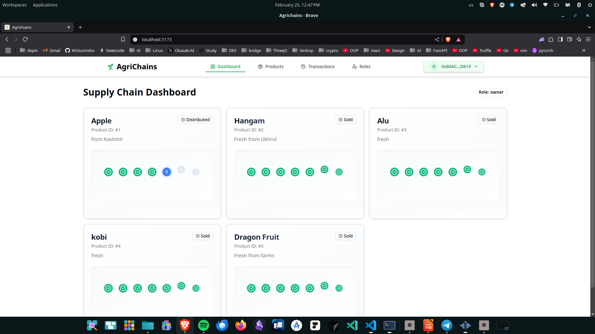

# 🌾 Agrichains: Blockchain-based Agricultural Supply Chain Management

## 📋 Introduction
Agrichains is a decentralized agricultural supply chain management system developed for **Regen Hackathon 2025**. The project aims to enhance transparency, security, and efficiency in the agricultural supply chain by leveraging blockchain technology.

## 🛠️ Technologies Used

| Category | Technology |
|----------|------------|
| **Smart Contract** | Solidity |
| **Blockchain** | Ganache private blockchain |
| **Development Framework** | Truffle |
| **Frontend** | React.js with Tailwind CSS and ShadCN UI |

## 👥 Team Members

| Member | Role |
|--------|------|
| **Khuaijam Gunindro** | Smart Contract Developer |
| **Muidou Kanshouwa** | Documentation and UI Tweaking |
| **Chanyahor Shimray** | UI and React Tweaking |
| **Mechanshil Maring** | Web3Context Developer |

## 📊 Smart Contract Overview
The smart contract manages the various stages of an agricultural product's lifecycle. It defines roles such as farmers, processors, distributors, and retailers, enabling transparent tracking of product movements.

## ✨ Contract Features
- **Role Management**: Allows adding farmers, processors, distributors, and retailers
- **Product Lifecycle Management**: Tracks a product through different stages
- **Stage Transition Functions**: Restrict actions based on user roles and enforce sequential stage progression
- **Events**: Emits events to notify the frontend of key transactions

### 🔄 Product Lifecycle Stages

| Stage | Icon | Description |
|-------|------|-------------|
| Registered | 📝 | Product is initially registered in the system |
| Planted | 🌱 | Seeds are planted by the farmer |
| Harvested | 🥕 | Crop is harvested and ready for processing |
| Processed | 🏭 | Raw product is processed into consumable form |
| Distributed | 🚚 | Product is shipped to retailers |
| Retail | 🏪 | Product is available at retail locations |
| Sold | 💰 | Product is purchased by end consumer |

## 📝 Smart Contract Functions

### 👨‍🌾 Role Management Functions

| Function | Parameters | Description |
|----------|------------|-------------|
| `addFarmer` | address, string, string | Registers a farmer |
| `addProcessor` | address, string, string | Registers a processor |
| `addDistributor` | address, string, string | Registers a distributor |
| `addRetailer` | address, string, string | Registers a retailer |

### 🥦 Product Management Functions

| Function | Parameters | Description |
|----------|------------|-------------|
| `addProduct` | string, string | Registers a new product |
| `showStage` | uint256 | Returns the current stage of a product |

### 🔄 Stage Transition Functions

| Function | Parameters | Called By | Description |
|----------|------------|-----------|-------------|
| `plantProduct` | uint256 | Farmer | Marks a product as planted |
| `harvestProduct` | uint256 | Farmer | Marks a product as harvested |
| `processProduct` | uint256 | Processor | Marks a product as processed |
| `distributeProduct` | uint256 | Distributor | Marks a product as distributed |
| `receiveProduct` | uint256 | Retailer | Marks a product as received by a retailer |
| `sellProduct` | uint256 | Retailer | Marks a product as sold |

## 💻 Frontend Integration
The frontend interacts with the smart contract via Web3.js, providing a user-friendly interface for role-based interactions.

### 🔑 Key Features
- **User Authentication**: Identifies user roles dynamically
- **Product Lifecycle Visualization**: Displays the current status of products in real time
- **Transaction History**: Logs all product movements for transparency

## 🚀 Deployment & Testing

| Environment | Tool | Purpose |
|-------------|------|---------|
| **Local Development** | Ganache | Private blockchain for testing |
| **Contract Deployment** | Truffle Suite | Managing contract deployment and migration |
| **Frontend** | React.js | User interface with Web3Context integration |

## 📱 App Showcase

## 🔮 Future Enhancements

| Enhancement | Description | Benefit |
|-------------|-------------|---------|
| **IPFS Integration** | Decentralized product data storage | Ensures data immutability and availability |
| **Public Blockchain Deployment** | Migration to Ethereum or Polygon | Increases security and wider adoption |
| **Multi-language Support** | AI chatbot with multiple language capabilities | Makes the application accessible to diverse farming communities |
| **USSD Menu Integration** | Simplified navigation for feature phones | Enables access for farmers without smartphones |
| **Voice Command Integration** | Speech recognition for hands-free operation | Improves usability during fieldwork |

## 🏆 Conclusion
Agrichains is an innovative approach to modernizing the agricultural supply chain using blockchain technology. By ensuring transparency, security, and efficiency, this system aims to revolutionize the way agricultural products are managed and tracked.